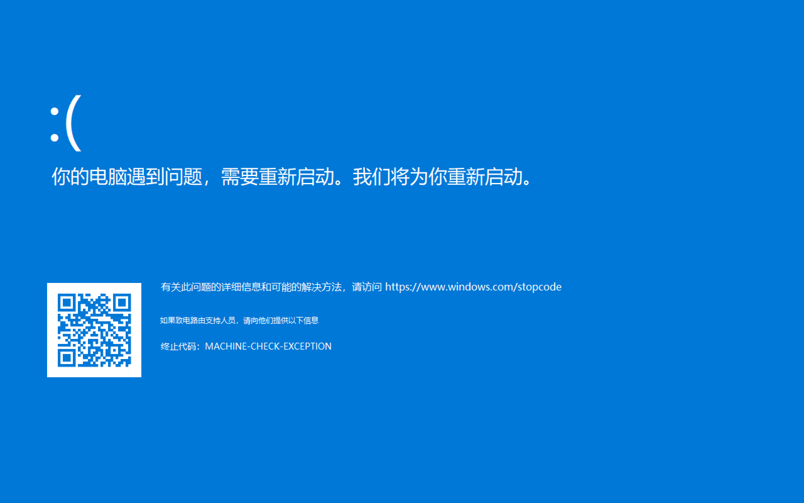

# FakeBlueScreen
## 描述

让WIN10显示20S的蓝屏，然后删掉自己，无毒无害。

## 体验

​	可以Clone本项目到计算机自己编辑一些东西看看，也可以试试已经编译好的[这个](./publish/test.exe)。

​	放一张截图：

## 详细

1. 突发奇想做的小小程序，其中的代码大多来自网络搜索，即想实现什么样的功能就搜索什么。
2. 目前该程序功能已达到心理预期：
   - 不显示鼠标指针悬浮窗等东西（TopMost）
   - 不响应按键（`Alt + F4`、`Win`），经测试虽然响应`Ctrl + Alt + Del`，但进不了任务管理器。
   - 经过一段时间完全销毁自己。
   - 不被报毒（<u>正常的程序</u>）
3. 作用？感觉新鲜罢了。
4. 有人做了？没去找，我就是想自己做来玩玩。
